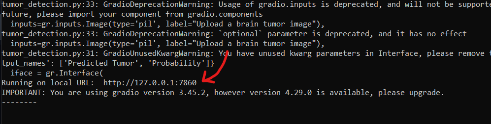
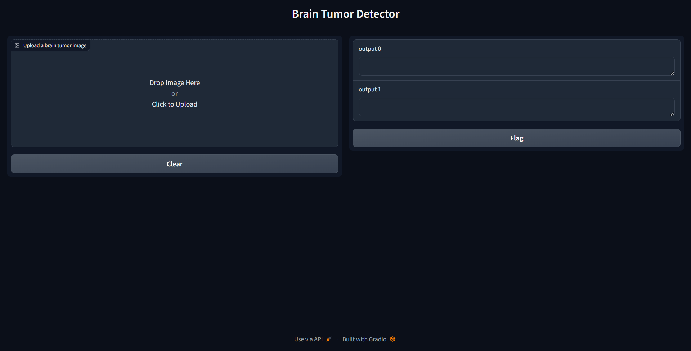
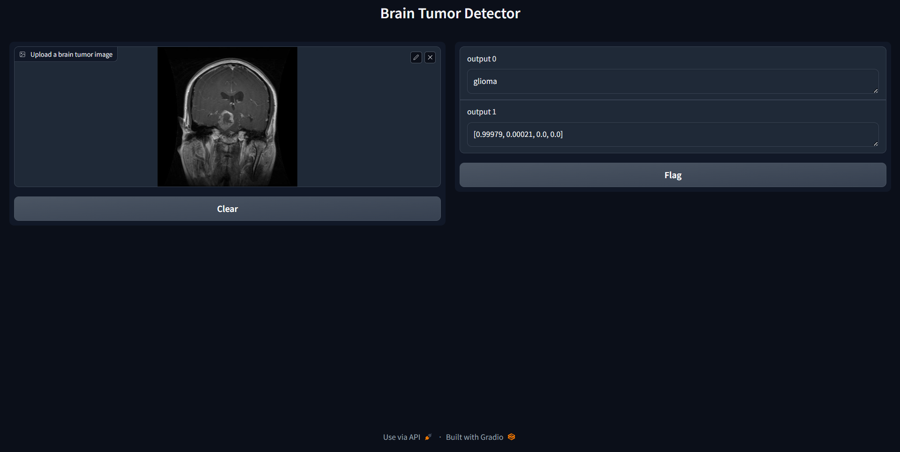

# Brain-Tumor-Detection
This project introduces a novel and advanced system for the early detection of brain tumors utilizing Convolutional Neural Networks (CNN) in combination with the Gradio interface. The primary focus of this AI-driven solution is to accurately categorize brain tumor types, which include glioma, meningioma, and pituitary tumors. The model is trained on a diverse dataset, including a "no tumor" class with MRI scan images of healthy brains, ensuring comprehensive diagnostic capabilities.The significance of this project lies in its potential to revolutionize the field of medical diagnostics. 
## Content
   - [Installation](https://github.com/CodeWizardRakesh/Brain-Tumor-Detection/blob/main/README.md#installation)
   - [Dataset](https://github.com/CodeWizardRakesh/Brain-Tumor-Detection/edit/main/README.md#dataset)
   - [Usage](https://github.com/CodeWizardRakesh/Brain-Tumor-Detection/blob/main/README.md#dataset)
   - [Sample Results](https://github.com/CodeWizardRakesh/Brain-Tumor-Detection/blob/main/README.md#sample-results)
## Installation
   ``` bash
   pip install tensorflow
   ```
   ``` bash
   pip install opencv-python
   ```
   ``` bash
   pip install pillow
   ```
   ``` bash
   pip install gradio
   ```
   ``` bash
   pip install numpy
   ```
## Dataset
   ``` bash
   https://www.kaggle.com/datasets/masoudnickparvar/brain-tumor-mri-dataset
   ```
## Usage
## Step 1 :
 - Clone this repositary
 ```bash
 git clone https://github.com/CodeWizardRakesh/Brain-Tumor-Detection
 ```
 - use '!' symbol in the front if you are using jupyter notebook.
## Step 2 :
   - Download the dataset from the link and save it in the project directory.
## Step 3:
   - Run b_tumor_model2.py file
   ```bash
      python b_tumor_model2.py
   ```
   - It is a python file which loads and prepreprocess the data which will be then passed into the Sequential model of CNN for training it.
   - The trained model will be store into the project's directory as .h5 file format named 'brain_tumor_model2'
## Step 4:
   - Run tumor_detection.py file
   ```bash
      python tumor_detection.py
   ```
   - It is the main file that is used to predict the type of brain tumor in the given MRI image of brain.
   - **When you run this code a local host link will be generated in the terminal. Follow that link. A gradio interface will be opened where you will be having a frame for uploading image of the MRI scan. You can predict the tumor just by clicking the 'Submit' button** 
         
## Sample Results
- Follow this link
  

- Graio interface
  

- Predicted Output
  

